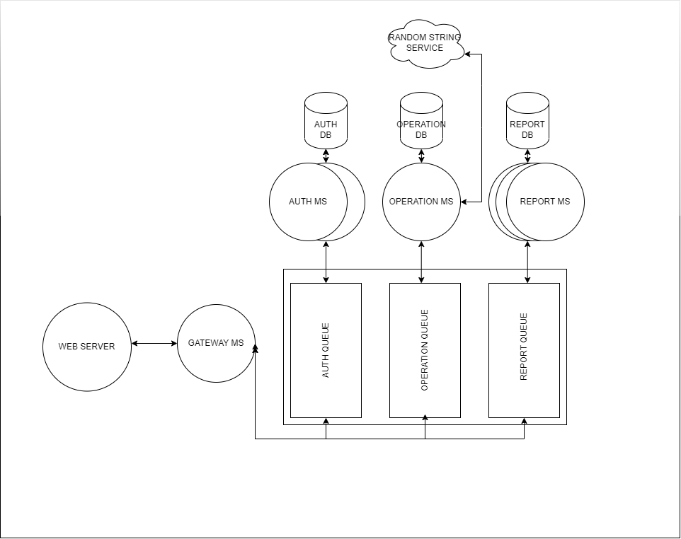

# Api server

This is the api server, handles the system logic.

## Setup

1. Edit the file `.env-example` according to your needs, you don't need change most of the variable values, maybe `OPERATIOM_RANDOM_API_KEY` wich is the API key from `https://www.random.org/clients/` that you will need to generate random strings.

1. Copy the env files to the microservices folder and the current folder (_the docker compose file uses the env var to setup the databases_):  
   `cp .env-example ./.env`  
   `cp .env-example ./auth_ms`  
   `cp .env-example ./operation_ms`  
   `cp .env-example ./report_ms`  
   `cp .env-example ./gateway_ms`  
   For production you will want to use a env file for every ms, but for now one master file is ok

1. Edit the `./docker/caddy/Caddyfile` chaging the domain for the one you will use

1. Run the docker compose script  
`docker compose up`

1. Clean up  
Run `docker compose down --rmi local -v` to delete container and images used by the system  

## Infraestructure



The system in divided in 4 microservices (gateway, auth, operation and report microservice), 3 databases (auth databas, operation database, report database), 1 message broker and 1 web server.

- The webserver handles HTTPS and is the public face of the system.
- The gateway microservice handles authorization (wit the help of auth ms), input validation, routes and centralize the operation.
- The Auth ms handles user creation and user login (token validation)
- The operation ms handles the main logic (generate random strings and execute math operations), after every operation sends a event to the report ms to store the history record
- The report ms stores the operation records and (soft) deletes them when requested
- The auth DB is used by the auth ms to store the users
- The operation DB is used by the operation ms, this DB stores the credit of users (needed to execute operations) and the cost of every operation.
- The report DB is used by the report ms, stores the operation history of every user.
- The message broker is used to comunicate the microservices, every time a ms need something from another ms emit a message to the corresponding queue, the microservices know nothing about each other and only communicates with the queues.

## API

`POST /v1/user/register`  
Body:

```typescript
{
    "username": string;
    "password": string;
}
```

Create a user.

---

`POST /v1/user/login`
Body:

```typescript
{
    "username": string;
    "password": string;
}
```

Response:

```typescript
{
    "token": string;
}
```

Exchange the user credentials for a token needed to use the other endpoints.

---

`POST /v1/operation/simple`

Headers:
```typescript
{
    "authorization": "bearer string" 
}
```

Body:

```typescript
{
    "operator": "+" | "-" | "/" | "*" | "√",
    "operands": number[]
}
```

Response

```typescript
{
    status: boolean,
    error?: string,
    value?: nmber
}
```
Execute the operation according to the `operand`, the square root operator (√) only accepts 1 operand.  
Execute the opeartion like a stack:  
```json
{
    "operator": "+" ,
    "operands": number[1,2,3,4,5]
}
```
is the same as `1+2+3+4+5`   
the enpoint will charge the user with the cost of the operator operation regarless the amount of operands.

---

`POST /v1/operation/complex`

Headers:
```typescript
{
    "authorization": "bearer string" 
}
```

Body:

```typescript
{
    "mathExpression": string
}
```

Response

```typescript
{
    status: boolean,
    error?: string,
    value?: number,
    userBalance: number,
}
```
Execute the `mathExpression` 
the enpoint will charge the user with the cost of every operator in `mathExpression` even if the `mathExpression` produces an error or is sintactically incorrect (example:`1+1-4+++`), so if the cost of the operator + (add) is 1 credit the `mathExpression` `1+2+3+4+5+` will cost 5 credits and will produce and error.
Parenthesis can be used to group operations (parenthesis grouping is free), example: `√(1+2)*3+4+5`

---

`POST /v1/operation/random-string`

Headers:
```typescript
{
    "authorization": "bearer string" 
}
```

Body:

```typescript

```

Response

```typescript
{
    status: boolean,
    error?: string,
    value?: number
    userBalance: number
}
```

Generates a random string

---

`GET /v1/operation/report`

Headers:
```typescript
{
    "authorization": "bearer string" 
}
```

Body:

```typescript
{
  "page"  : null | number //default 1
  "perPage": null| number //default 10
  "like": null |string // default null
  "sort": null | 'date' | 'operation_type' //default date
  "order": null | 'ASC' | 'DESC' // default DESC
}

```

Response

```typescript
{
    data: record[]
    total: number
}
```

Return a list of user's operations record, all the body parameters are optional.  
The body parameters can be used to modify the returned records:  
`page`: the number of the page result to obtain  
`perPage`: the number of record per page (max: 100)  
`like`: can be used to get record tha include the `like` content in the amount  
`sort`  : used to sort the results  
`order`: used to order the results  

Example response:  

```json
{
    "total": 2,
    "items":[
        {
            "id": "853cfa62-ff69-4e86-a63a-3f5f60ee1a06",
            "user_id": "5d1ebbe6-dee4-433b-be8e-836e7e48d853",
            "operation_type": "complex",
            "user_balance": 567,
            "amount": "√16",
            "operation_response": "4",
            "date": "2023-04-09T11:44:00.045Z",
            "active": 1
        },
        {
            "id": "853cfa30-ff69-4e86-a63a-3f5f60ee1a06",
            "user_id": "5d1ebbe6-dee4-433b-be8e-836e7e48d853",
            "operation_type": "+",
            "user_balance": 567,
            "amount": "1, 2, 3",
            "operation_response": "6",
            "date": "2023-04-09T11:47:23.002Z",
            "active": 1
        }
    ]
}
```

---

`POST /v1/operation/:id/delete`

Headers:
```typescript
{
    "authorization": "bearer string" 
}
```

Body:

```typescript
```

Response

```typescript

```

Deletes the user's operation record with the id `id`